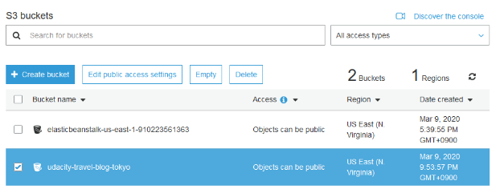
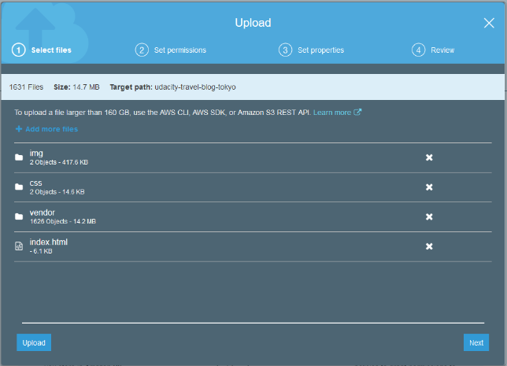
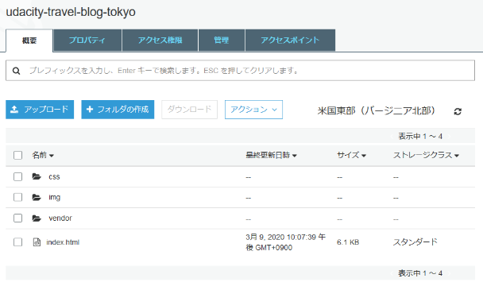
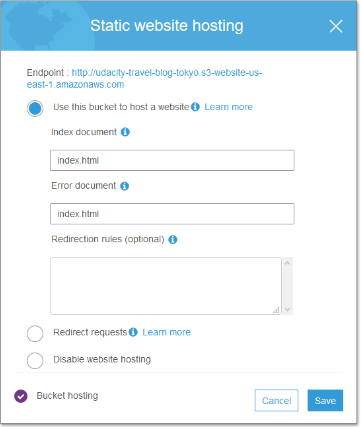
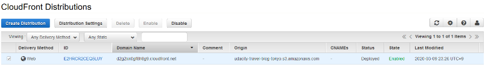

# Deploy Static Website on AWS

## This is the result of this project

### 1. The S3 bucket is visible in the AWS Management console.  



### 2. The student has submitted a screenshot showing all the website files uploaded to the newly created S3 bucket.    




### 3. The S3 bucket is configured to support static website hosting.   


### 4. The S3 bucket has an IAM bucket policy that makes the bucket contents publicly accessible.   



### 5. CloudFront has been configured to retrieve and distribute website files. 




### 6. The website should be accessible to anyone on the Internet via a web browser. The student should have provided the CloudFront endpoint URL for the website.

- URL   
```http://d2g2wx0gf8h8g9.cloudfront.net/index.html ```

